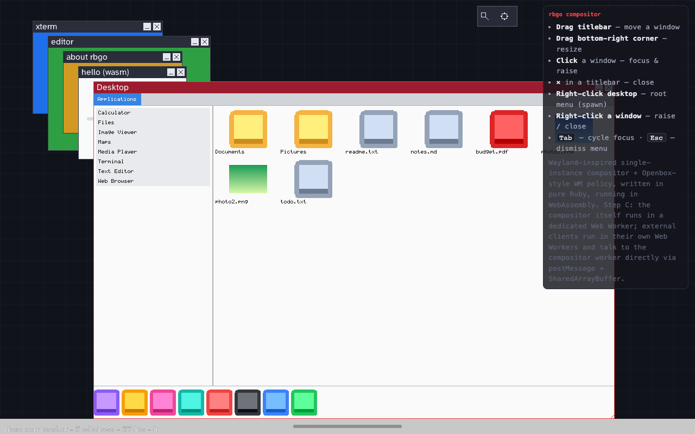
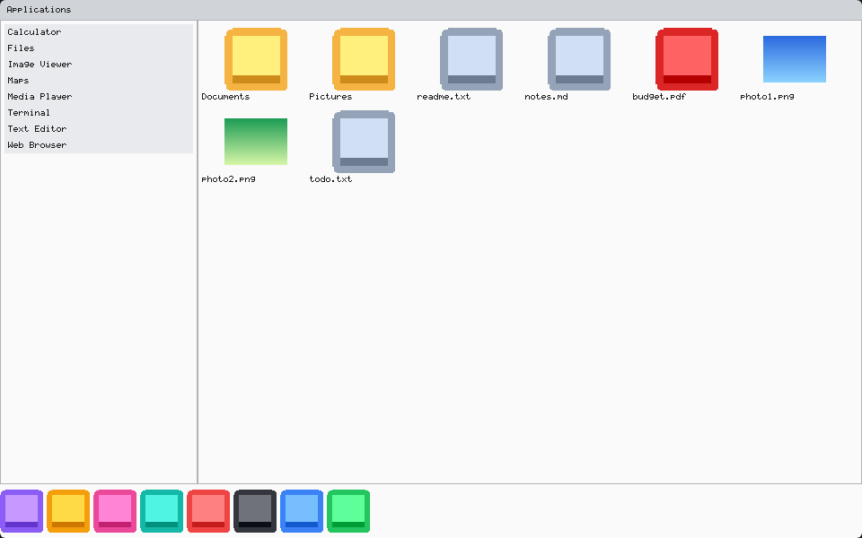
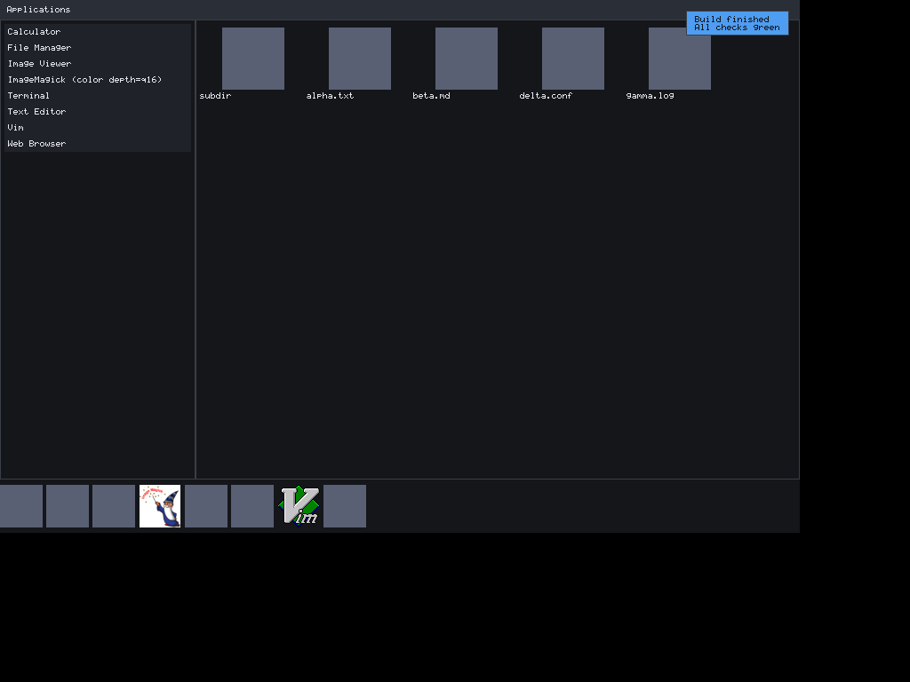

# desktop

[](https://github.com/go-widgets/desktop/actions/workflows/ci.yml)
[](https://pkg.go.dev/github.com/go-widgets/desktop)


A native, pure-Go (CGO=0) **desktop-shell demo** that composes the whole
`go-freedesktop` + `go-widgets` stack into one runnable app. Each freedesktop
library does its real job against a real Linux filesystem, and the UI is drawn
entirely with go-widgets widgets and box layouts.

## What each library drives

| Feature | Library | What it does here |
|---|---|---|
| Dock + launcher | [`go-freedesktop/desktopentry`](https://github.com/go-freedesktop/desktopentry) | `Scan()` → the app index; `ExpandExec` → launch argv |
| Icons | [`go-freedesktop/icontheme`](https://github.com/go-freedesktop/icontheme) | `FindIcon` → PNG/JPEG rasterized into go-widgets `Image` |
| Application menu | [`go-freedesktop/menu`](https://github.com/go-freedesktop/menu) | `Load()` → a categorized tree rendered as a go-widgets `MenuBar`/`Menu` |
| "Open with" | [`go-freedesktop/mime`](https://github.com/go-freedesktop/mime) + [`mimeapps`](https://github.com/go-freedesktop/mimeapps) | `TypeByNameAndContent` + `Candidates`/`DefaultApp` |
| File grid + thumbnails | [`toolkit/virtual`](https://github.com/go-widgets/toolkit) `VirtualGrid` + [`go-thumbnail`](https://github.com/go-thumbnail/thumbnail) | virtualized gengrid over a directory, thumbnail cache keys per cell |
| Notifications | [`go-freedesktop/notifications`](https://github.com/go-freedesktop/notifications) | a live `org.freedesktop.Notifications` daemon → go-widgets `Toast`s |

## Architecture

Composition/model logic is separated from raw rendering:

- **`shell/`** — pure, side-effect-light model logic with **100% statement
  coverage** (including error branches): the launchable-app index, MIME
  "open with" resolution, the categorized menu model, the directory listing
  model and the thumbnail cache-key policy. No rendering surface, so every
  branch is unit-coverable against temp-dir fixtures.
- **`render/`** — turns those models into a go-widgets widget tree. The shell is
  a `Border` layout (menubar north, dock south, launcher west, file grid center)
  plus a floating `Toast` stack. State flows through `go-widgets/mvvm`
  (`Observable` search query → `ObservableList` results → the launcher).
  `Scene.Widget()` wraps the whole thing — root plus the toast overlay — as one
  backend-agnostic `toolkit.Widget` a windowing backend can drive.
- **`cmd/desktop/`** — the native binary: scans the filesystem, composes the
  scene and either opens a **real window** (the default) or renders it to a PNG
  (`-capture`).
- **`source/`** — the two [`shell.AppSource`](shell/source.go) implementations
  behind the shell (see below).
- **`clients/desktop/`** — the **wasmdesk client** (`js/wasm`): the exact same
  shell composed from the embedded source and presented to the wasmdesk
  compositor. It opens its surface through the **same** `window.Open()` the native
  binary uses — on `js/wasm` that returns
  [`go-widgets/window`](https://github.com/go-widgets/window)'s wasmbox client
  backend, so there is one windowing code path, native and browser (no
  desktop-local backend to maintain).

## Same source, two targets

The shell's data is abstracted behind one seam,
[`shell.AppSource`](shell/source.go): installed apps, the categorized menu, the
directory listing, "open with" resolution, icon bytes and thumbnail keys. There
are two implementations in [`source/`](source), and `render.New` composes the
**identical** Scene from either:

| Target | Source | Data | Backend |
|---|---|---|---|
| Native (Linux desktop) | `source.NewXDG` | real XDG filesystem (`desktopentry.Scan`, icontheme, mime/mimeapps, `menu.Load`, go-thumbnail) | `go-widgets/window` (X11/Wayland) |
| Browser (wasmdesk) | `source.NewEmbedded` | a curated app set + icons + virtual files from an `embed.FS` — **no filesystem** | `go-widgets/window` (wasmbox client) |

So the browser desktop is not a mock: it is the same `shell` model logic, the
same `render` widget tree, AND the same `window.Open()`/`Backend.Run()` windowing
path as the native binary — only `source.NewXDG`→`source.NewEmbedded` differs.
The wasmbox client wire (`hello`/`welcome`/`commit`/`input` over the compositor's
`MessagePort` + `SharedArrayBuffer`) lives entirely inside `go-widgets/window`,
so this repo hosts no duplicate backend.

**Primary browser proof — the REAL wasmdesk desktop.** The shell runs as a
genuine external client of the actual wasmdesk/wasmbox Ruby compositor (the
pure-Go `rbgo` interpreter running `compositor/*.rb`, baked into `wasmbox.wasm`),
spawned via the documented `globalThis.wasmboxSpawnExternal(...)` hook and served
same-origin through a symlink overlay — **the wasmbox repository is never
modified**. Playwright locates the window by its live focused rect
(`__wasmboxFocusedRect`), asserts the shell (dock, launcher, application menu,
file grid) rendered into the composited desktop, and round-trips one real click.
See [`clients/desktop/harness/probe-real-desktop.mjs`](clients/desktop/harness/probe-real-desktop.mjs)
and [`clients/desktop/harness/README-real-desktop.md`](clients/desktop/harness/README-real-desktop.md):



**Deterministic CI floor.** The protocol-faithful harness
([`clients/desktop/harness`](clients/desktop/harness)) drives the identical
wire/SAB/input assertions with no Ruby compositor build, so it gates anywhere:



go-widgets is a pure pixel-blitting toolkit. With no flags the shell opens a
**real window** on the running display server via
[`go-widgets/window`](https://github.com/go-widgets/window) — which auto-selects
the pure-Go **Wayland** backend when `$WAYLAND_DISPLAY` is set, else the pure-Go
**X11** backend — and drives the widget tree through its `Run` loop
(resize → relayout, window close → quit). Notification toasts render as a
floating overlay on top of the live shell. On a headless host, or with
`-capture`, the shell renders into an offscreen framebuffer and `-capture`
writes it to a PNG — the headless "screenshot" path.

Below is the live X11 window (under Xvfb) showing the dock, launcher, file grid
and a notification `Toast` — the [`live shell (windowed)` CI lane](.github/workflows/ci.yml)
captures and pixel-asserts exactly this:



## Usage

```sh
go run ./cmd/desktop                                        # open a real window (X11/Wayland)
go run ./cmd/desktop -dir ~/Pictures                        # windowed, file grid on a directory
go run ./cmd/desktop -dir ~/Pictures -capture shell.png     # headless: render to PNG
go run ./cmd/desktop -query fire                            # seed launcher filter
go run ./cmd/desktop -launch org.mozilla.firefox            # expand Exec + launch
go run ./cmd/desktop -embedded -capture browser.png         # the exact scene the wasmdesk client shows

# Browser (wasmdesk) client:
GOOS=js GOARCH=wasm go build -o desktop.wasm ./clients/desktop   # build the wasm client
clients/desktop/harness/run.sh                                   # prove it in a real headless browser

# Notifications need a session bus (Linux); the toast shows in the window:
dbus-run-session -- go run ./cmd/desktop -notify "Build|Finished"
dbus-run-session -- go run ./cmd/desktop -notify "Build|Finished" -capture toast.png
```

## License

BSD-3-Clause. Copyright (c) 2026 the go-widgets/desktop authors.
